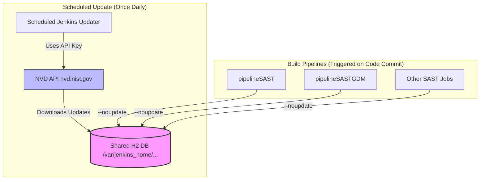

# OWASP Dependency-Check NVD Sync Issues and Solution Guide

This document outlines the investigation, findings, remediation steps, and current implementation status for National Vulnerability Database (NVD) sync errors within our SAST (Static Application Security Testing) Jenkins pipelines.

---

## 1. Initial Troubleshooting & Findings

### 1.1. The Error Report (Case 1)

Our main SAST pipeline ([pipelineSAST.groovy](Pipelines/vars/pipelineSAST.groovy)) began failing during the database update stage with the following output:

```text
[INFO] Checking for updates
[WARN] NVD API request failures are occurring; retrying request for the 15th time
...
[INFO] NVD API has 342,053 records in this update
[WARN] NVD API request failures are occurring; retrying request for the 31st time
[ERROR] Error updating the NVD Data
org.owasp.dependencycheck.data.update.exception.UpdateException: Error updating the NVD Data
...
Caused by: io.github.jeremylong.openvulnerability.client.nvd.NvdApiException: NVD Returned Status Code: 503
[ERROR] No documents exist
```

### 1.2. Root Cause Analysis (RCA)

1. **NVD API Rate-Limiting:** The NVD API enforces strict limits on requests (max 50 requests per 30 seconds with an API key, and 5 requests per 30 seconds without one). Because the main SAST pipeline did not use the `--noupdate` flag, **every single build** attempted to query the NVD API to check for updates.
2. **Thundering Herd Effect:** When multiple build jobs or branches run concurrently, their collective API requests quickly exceed the rate limits. This results in the API gateway throttling connections and returning `503 Service Unavailable` or `524 Gateway Timeout` errors.
3. **Database Write-Lock Contention:** All builds mount the same shared controller directory (`/var/jenkins_home/OWASP-Dependency-Check/data`) to cache the H2 database (`odc.mv.db`). Because H2 utilizes file-level locking, concurrent builds attempting to write/update this file block each other, causing retries that further overload the NVD API.
4. **Misplaced `-n` Flag (Critical Bug):** The pipeline passed `-n` as part of the `--project` name string (`"${DC_PROJECT} -n"`), not as a Dependency-Check CLI flag. Jenkins logs confirmed this:

   ```text
   --project NAVIOPER » INTEGRACION » BACK » ANALISIS-ESTATICO #950 -n --out /report
   ```

   The scanner therefore never received `--noupdate` and always attempted a live NVD sync.

### 1.3. Key Comparison

An inspection of the codebase showed that another pipeline, [pipelineSASTGDM.groovy](Pipelines/vars/pipelineSASTGDM.groovy), avoids this exact issue. It uses the `--noupdate --disableCentral` flags during build scans, relying on a pre-populated cache instead of fetching live updates from the NVD API.

### 1.4. Scheduled Database Updater Failure (Case 3)

A scheduled job was initially configured under `PRUEBAS/ActualizaDependencyCheckDataBase` using contradictory arguments:

```groovy
dependencyCheck additionalArguments: '--updateonly -n --nvdApiKey <NVDApiKey>',
                 odcInstallation: 'Dependency-Check-12.1.3'
```

However, the job failed with a **524 Gateway Timeout**:

```text
[INFO] Downloaded 60,000/341,559 (18%)
[WARN] Retrying request /rest/json/cves/2.0?...resultsPerPage=2000&startIndex=70000 : 4th time
...
Caused by: io.github.jeremylong.openvulnerability.client.nvd.NvdApiException: NVD Returned Status Code: 524
```

* **The Conflict:** Passing both `--updateonly` and `-n` (short for `--noupdate`) is a logical contradiction. While `--updateonly` forces the update phase, the presence of `-n` is confusing and redundant.
* **The Root Cause:** The updater job was **untuned**. It queried pages of `resultsPerPage=2000` at deep offsets (`startIndex=70000`). Compiling this payload timed out the NIST backend servers, causing Cloudflare to return a `524` error, which eventually crashed the thread reactor.
* **Conclusion:** Even dedicated updaters *must* be tuned to use smaller page sizes (e.g., `500`) and slight delays to prevent remote timeouts.

**Status:** The updater job has since been corrected and is running successfully. It is now the sole job responsible for writing to the shared NVD cache.

---

## 2. Solution: The "One-Updater, Many-Readers" Pattern

To decouple the network dependency from build execution, we implemented the **"One-Updater, Many-Readers"** pattern:

* Only **one** dedicated job is permitted to update the NVD database (running at off-peak hours).
* All build pipelines run in **read-only mode** (`--noupdate`), rendering them immune to NVD API downtime and rate-limiting.



### Step 1: Centralized Jenkins Updater Job (Configured)

Create a scheduled Jenkins job (e.g., `Dependency-Check-Updater` or `PRUEBAS/ActualizaDependencyCheckDataBase`) to run once daily during off-peak hours (e.g., `H 2 * * *`).

#### Option A: Docker CLI Command (Recommended for pipelineSAST.groovy)

If your agents execute the scanner inside a container, have the updater job run the following script using the `withCredentials` block to securely bind the NVD API Key.

*Note: Add `--nvdApiResultsPerPage 500` and `--nvdApiDelay 5000` to prevent Cloudflare 524 timeouts.*

```groovy
pipeline {
    agent any
    stages {
        stage('Update NVD Cache') {
            steps {
                withCredentials([string(credentialsId: 'NVDApiKey', variable: 'NVD_API_KEY')]) {
                    sh '''
                        mkdir -p "/var/jenkins_home/OWASP-Dependency-Check/data"

                        docker run --rm \
                          -v "/var/jenkins_home/OWASP-Dependency-Check/data":/usr/share/dependency-check/data:z \
                          owasp/dependency-check:latest \
                          --updateonly \
                          --nvdApiKey "$NVD_API_KEY" \
                          --nvdApiResultsPerPage 500 \
                          --nvdApiDelay 5000
                    '''
                }
            }
        }
    }
}
```

#### Option B: Jenkins Pipeline DSL (Plugin-based updater)

If your builds use the Jenkins plugin wrapper, create a Pipeline script for the updater leveraging the credentials helper and including the tuning parameters.

*Note: Do not pass `-n` / `--noupdate` alongside `--updateonly`.*

```groovy
pipeline {
    agent any
    environment {
        NVD_API_KEY = credentials('NVDApiKey')
    }
    stages {
        stage('Update Database') {
            steps {
                dependencyCheck additionalArguments: "--updateonly --nvdApiKey ${env.NVD_API_KEY} --nvdApiResultsPerPage 500 --nvdApiDelay 5000",
                                odcInstallation: 'Dependency-Check-12.1.3'
            }
        }
    }
}
```

---

### Step 2: Build Pipelines in Read-Only Mode

> [!NOTE]
> Since build-time scans run in read-only mode (`--noupdate`), they no longer communicate with the NVD API. The NVD API Key and OSS Index credentials can be removed from build pipelines, eliminating unnecessary credentials exposure and Jenkins Groovy string interpolation warnings.

#### pipelineSAST.groovy — **IMPLEMENTED**

The following changes were applied to [pipelineSAST.groovy](Pipelines/vars/pipelineSAST.groovy):

| Change | Before | After |
|--------|--------|-------|
| NVD sync | Live update on every build | `--noupdate --disableCentral` |
| NVD API key | `--nvdApiKey $NVD_API_KEY` on scan | Removed from scan stage |
| OSS credentials | Passed via Groovy interpolation | Removed (OSS Index already disabled) |
| Project name | `"${DC_PROJECT} -n"` (bug: `-n` was part of the name) | `"${DC_PROJECT}"` |

**Environment block:** `NVD_API_KEY`, `OSS_USERNAME`, and `OSS_API_KEY` were removed from the build pipeline environment.

**Dependency-Check scan stage (current):**

```groovy
// With suppression file
sh """docker run --rm -e user=root -u \$(id -u root):\$(id -g root) -v "${DC_DATA_DIRECTORY}":/usr/share/dependency-check/data:z -v \$(pwd)/odc-reports:/report:z ${APP_NAME}:sast --noupdate --disableCentral --scan /src --disableOssIndex --disableYarnAudit --prettyPrint --format HTML --format XML --format CSV --project "${DC_PROJECT}" --out /report --suppression "/src/${SUP_FILE_PATH}" """

// Without suppression file
sh """docker run --rm -e user=root -u \$(id -u root):\$(id -g root) -v "${DC_DATA_DIRECTORY}":/usr/share/dependency-check/data:z -v \$(pwd)/odc-reports:/report:z ${APP_NAME}:sast --noupdate --disableCentral --scan /src --disableOssIndex --disableYarnAudit --prettyPrint --format HTML --format XML --format CSV --project "${DC_PROJECT}" --out /report """
```

#### pipelineSASTGDM.groovy — Already Correct (Minor Cleanup Pending)

[pipelineSASTGDM.groovy](Pipelines/vars/pipelineSASTGDM.groovy) already uses `--noupdate --disableCentral`. Optional follow-up: remove the redundant `--nvdApiKey` argument from scan commands since read-only scans do not need it.

#### Plugin-based Jenkinsfiles (Case 2) — Pending

Modify the `dependencyCheck` step arguments to include `--noupdate` and remove the NVD API Key from scan builds:

```groovy
dependencyCheck additionalArguments: '--data /var/jenkins_home/OWASP-Dependency-Check/data --noupdate --prettyPrint --format HTML --format XML --format CSV',
                odcInstallation: 'Dependency-Check-12.1.3'
```

---

## 3. Impact of Hybrid Environment (Shared Library vs. Plugin Wrapper)

Because both Docker-based scans (via the Shared Library) and native plugin-based scans (via standalone Jenkinsfiles) coexist, we must account for differences in how they access and store database files.

### 3.1. Cache Path Discrepancies

* **The Problem:**
  * The Docker pipeline binds a specific host directory: `-v "/var/jenkins_home/OWASP-Dependency-Check/data":/usr/share/dependency-check/data:z`.
  * The Jenkins native plugin stores data in a default plugin directory (e.g. `/var/jenkins_home/dependency-check-data` or inside the job's workspace).
  * If left unconfigured, the two tools will operate on two separate H2 databases. The centralized updater will only update one, causing the other to fall out of date or perform unauthorized updates (leading back to 503/524 rate-limiting errors).
* **The Fix: Unify the Data Directory**
  Align the native plugin builds to use the exact same directory on the host using the `--data` flag:

  ```groovy
  dependencyCheck additionalArguments: '--data /var/jenkins_home/OWASP-Dependency-Check/data --noupdate --prettyPrint --format HTML --format XML --format CSV',
                  odcInstallation: 'Dependency-Check-12.1.3'
  ```

### 3.2. Build Agent Node Distribution (Distributed CI)

* **The Problem:**
  The path `/var/jenkins_home/...` is local to the Jenkins controller. If your Jenkins instance distributes builds to remote agent nodes, those nodes will not have access to the controller's local storage path.

* **Docker-in-Docker (DinD) Runner Environment:**
  If your runner agents are configured as **Docker-in-Docker (DinD) runners** on the same host or cluster:
  * **No Network Configuration Required:** Because the build agents run on the same virtual network/host context, you do **not** need to set up complex NFS or distributed filesystems to share the database cache.
  * **Volume Mapping:** You only need to ensure the shared directory `/var/jenkins_home/OWASP-Dependency-Check/data` is mounted to the DinD runner environment so that mapping the host path `-v "/var/jenkins_home/...":/usr/share/dependency-check/data` maps correctly inside the dynamic container.

* **Alternative (Solution 3 of RCA):**
  If network mounts are not feasible or if agents are distributed across isolated machines, you should implement a **local HTTP mirror** of the NVD feeds, pointing all builds to the internal mirror instead of local directories.

---

## 4. Benefits of this Solution

* **Zero Network Dependency during Builds:** Builds scan against local cache, eliminating timeouts (`524`) and rate-limiting (`503`).
* **Massive Scan Speed Improvements:** Builds skip the time-consuming database check/update step, shortening pipeline execution times by several minutes.
* **No H2 File Lock Conflicts:** Since builds operate strictly in read-only mode, they do not attempt to write to the H2 database, resolving concurrency issues.
* **Reduced Secret Exposure:** NVD and OSS credentials are only required on the updater job, not on every SAST build.

---

## 5. Verification Checklist

After deploying the `pipelineSAST.groovy` changes, confirm the following:

1. **Updater job succeeded** and `/var/jenkins_home/OWASP-Dependency-Check/data/odc.mv.db` exists on the controller.
2. **Shared library refreshed** in Jenkins so jobs pick up the updated `pipelineSAST.groovy`.
3. **Build logs do not show** `[INFO] Checking for updates` or NVD API retry warnings.
4. **Build logs do show** scan completion and reports generated under `odc-reports/`.
5. **Concurrent SAST builds** complete without H2 lock contention or NVD API errors.

If a scan fails with `No documents exist`, run the updater job manually first. Read-only scans require a populated shared cache.

---

## 6. Real-World Case Study: Rockwell_Web_FE Pipeline

The `Rockwell_Web_FE` pipeline completes the Dependency-Check scan successfully in **22 seconds** without encountering any NVD rate-limiting or timeout errors.

### 6.1. The Scan Configuration

The pipeline invokes the scanner with the following arguments:

```groovy
dependencyCheck(
    additionalArguments: '--prettyPrint --format HTML --format XML --format CSV -n --exclude "**/node_modules/**" --disableOssIndex --scan "."',
    odcInstallation: 'Dependency-Check-12.1.3'
)
```

### 6.2. Why It Works (Differences & Mechanics)

1. **The `-n` Flag (The Key Difference):**
   The flag `-n` is the short alias for **`--noupdate`**. It must be passed as a standalone CLI argument — not embedded in `--project` or other string values. This tells Dependency-Check to skip the database update check entirely and use the existing local cache.
2. **Local Analysis Logs:**
   In the Rockwell logs, we observe:

   ```text
   12:14:57  [INFO] Finished NVD CVE Analyzer (0 seconds)
   12:14:58  [INFO] Analysis Complete (22 seconds)
   ```

   Because `-n` was passed correctly, the `NVD CVE Analyzer` took **0 seconds** and did not attempt any remote NVD API network queries.
3. **Exclusion of `node_modules`:**
   By passing `--exclude "**/node_modules/**"`, the scanner avoids traversing thousands of nested JS files in the workspace (which often causes long scans or Java OutOfMemory crashes). Instead, it relies on the `Node.js Package Analyzer` to scan `package.json`/`package-lock.json` directly, completing the entire file parsing phase in under **9 seconds**.

### 6.3. Summary Checklist for Other Pipelines

To achieve the same stability in other pipelines:

* Pass `--noupdate` (or `-n`) as a **real CLI flag**, never as part of `--project` or other arguments.
* Verify database cache directories are aligned across Docker and plugin-based scans.
* Exclude third-party folders (like `node_modules` or Docker layers) from file-level directory sweeps where applicable.

---

## 7. Implementation Status

| Component | Status | Notes |
|-----------|--------|-------|
| Centralized updater job | Done | Running with tuned API parameters |
| `pipelineSAST.groovy` | Done | `--noupdate --disableCentral`; credentials removed from scan |
| `pipelineSASTGDM.groovy` | Done (minor cleanup optional) | Already read-only; `--nvdApiKey` on scan is redundant |
| Plugin-based Jenkinsfiles | Pending | Add `--data` + `--noupdate`; remove NVD key from scans |
