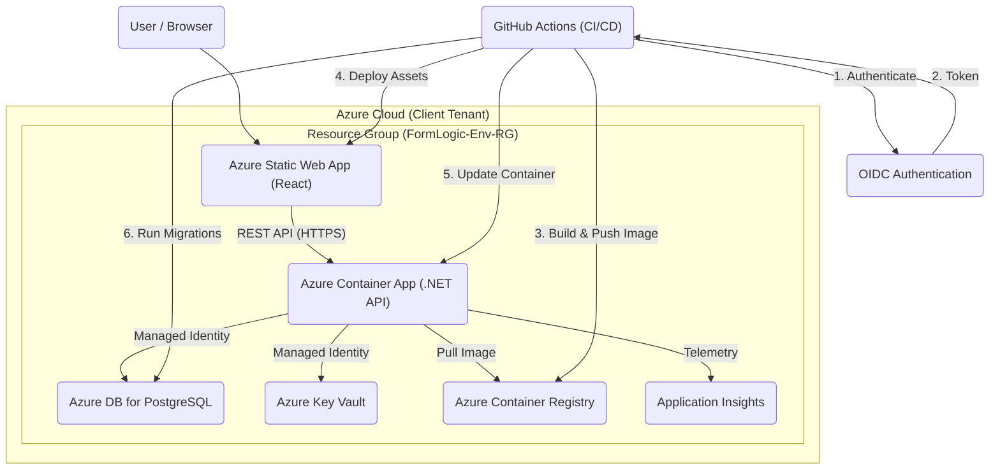

# ProtectDiv Deployment Plan

This document outlines the deployment strategy, infrastructure requirements, and CI/CD setup for the ProtectDiv project.

---

## 1. Project Overview

*   **`formlogic-api` (Backend)**:
    *   Technology: .NET 9, PostgreSQL database.
    *   Deployment: Docker Containers on Azure Container Apps (Serverless).
*   **`formlogic-web` (Frontend)**:
    *   Technology: React 19, TypeScript, Vite, pnpm.
    *   Deployment: Static web assets on Azure Static Web Apps.

---

## 2. Deployment Architecture

---

## 3. Azure Target Architecture

### 2.1. Infrastructure as Code (IaC)
*   **Decision**: **Bicep**.
*   **Rationale**: Native Azure support, no state file management, seamless integration with GitHub Actions.

### 2.2. Resources (per Environment)
*   **Backend**: Azure Container Apps (Serverless, Consumption plan).
*   **Database**: Azure Database for PostgreSQL (Flexible Server) v16.
*   **Frontend**: Azure Static Web Apps (Standard).
*   **Storage**: Azure Container Registry (ACR) and Azure Blob Storage.
*   **Security**: Azure Key Vault + Managed Identity.
*   **Observability**: Application Insights + Log Analytics Workspace.

### 2.3. Naming Convention & Grouping
Resources are isolated by **Resource Group per Environment**.
**Pattern**: `FormLogic-{Env}-{Resource}`

| Environment | Resource Group Name | Container App Name | Database Name |
| :--- | :--- | :--- | :--- |
| **Development** | `FormLogic-Dev-RG` | `FormLogic-Dev-Backend` | `FormLogic-Dev-DB` |
| **Testing** | `FormLogic-Test-RG` | `FormLogic-Test-Backend` | `FormLogic-Test-DB` |
| **UAT** | `FormLogic-UAT-RG` | `FormLogic-UAT-Backend` | `FormLogic-UAT-DB` |
| **Production** | `FormLogic-Prod-RG` | `FormLogic-Prod-Backend` | `FormLogic-Prod-DB` |

---

## 3. GitHub Configuration

### 3.1. Environments & Approvals
Four GitHub Environments will be created in both repositories:
*   **`dev`**: Automatic deployment.
*   **`test`**: Approval from **Alejandro Rozas**.
*   **`uat`**: Approval from **Alejandro Rozas**.
*   **`prod`**: Approval from **Lester** (Client).

### 3.2. Branch Protection (for `main`)
*   **Require Pull Request**: No direct merges allowed.
*   **Require Approvals**: At least 1 review.
*   **Status Checks**: CI build and tests must pass.

### 3.3. OIDC & Secrets (Backend)
OIDC will be used for password-less Azure login.
The following variables will be injected into the Backend Container App:
* `ConnectionStrings__DefaultConnection` (Key Vault / Secret)
* `AzureAd__TenantId` / `ClientId` / `Audience`
* `Cors__AllowedOrigins` (Frontend URL)
* `ASPNETCORE_ENVIRONMENT`

---

## 4. CI/CD Strategy

### 4.1. Deployment Flow
1.  **Build**: Docker build (Back) / pnpm build (Front).
2.  **Test**: Unit Tests and Linting.
3.  **Package**: Push Docker image to ACR / Stage assets.
4.  **Database Migration**: Run `dotnet ef database update` in the pipeline.
5.  **Deploy**: Update Container App / Static Web App.
6.  **Smoke Test**: Check `/health` endpoint.

### 4.2. Rollback Approach
*   **Backend**: Re-deploying previous Docker image tag from ACR.
*   **Frontend**: Reverting to previous build version in Static Web Apps.

---

## 5. Milestone: Dev Deployment (Ready by Friday)

### ✅ Task 1: Provision Resources (IaC)
*   Develop modular Bicep templates for ACR, Postgres, Container Apps.
*   Provision `FormLogic-Dev-RG` stack.

### 📋 Task 2: Create Pipelines (GitHub Actions)
*   Implement `deploy.yml` for both repositories.
*   Configure OIDC and Environment secrets/variables.

### 📋 Task 3: Implement Quality Gates
*   Integrate tests (Vitest/xUnit) and Linting.
*   Enforce initial coverage checks.

---

## 6. Outstanding Items

*   **Azure Access**: Need **Contributor** + **App Administrator** roles on the client tenant.
*   **Resource Providers**: Awaiting Lester to register `Microsoft.App` and others.

---
