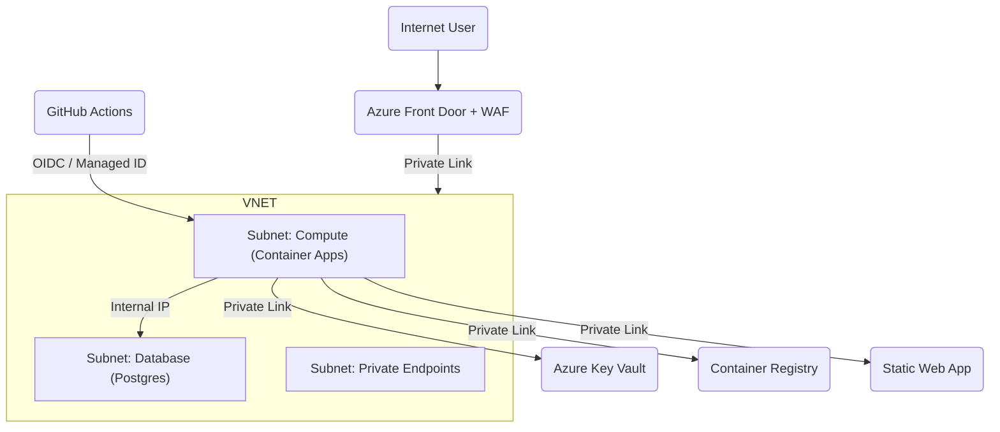

# ProtectDiv: Production Readiness & Landing Zone Proposal

This document outlines the architectural requirements and enhancements recommended to transition the ProtectDiv infrastructure from a functional Development/QA state to a resilient, secure, and scalable **Production Landing Zone**.

---

## 1. Executive Summary
The current infrastructure (Bicep + GitHub Actions + Container Apps) provides a strong foundation. To meet production standards, we propose a **Defense-in-Depth** strategy that adds network isolation, high availability, and centralized secret management.

---

## 2. Compute: Resilient Container Apps (ACA)
The production environment must survive individual instance failures and handle fluctuating traffic.

*   **High Availability**: Set `minReplicas: 2` across different Availability Zones.
*   **Autoscaling**: Implement scaling rules based on concurrent HTTP requests and CPU/Memory thresholds.
*   **Deployment Strategy**: Enable **Blue-Green Deployments** via Traffic Splitting. New revisions will be verified with 0% traffic before being promoted to 100%.
*   **Probes**: Implement dedicated Liveness, Readiness, and Startup probes to ensure only healthy containers receive traffic.

---

## 3. Data: Mission-Critical PostgreSQL
Move away from "Burstable" tiers to ensure consistent performance and data protection.

*   **Tier Upgrade**: Move to **General Purpose** tier to avoid CPU credit exhaustion.
*   **Zone Redundant HA**: Enable High Availability with a standby replica in a separate zone for < 60s failover.
*   **Storage Resilience**: Enable **Storage Auto-grow** and configure a 35-day backup retention policy.
*   **Performance**: Enable Query Store and Performance Insights to identify slow queries in production.

---

## 4. Frontend: Hardened Static Web Apps (SWA)
Application-level security and optimized delivery for the React 19 frontend.

*   **Browser Security Headers**: Implement a `staticwebapp.config.json` to enforce **Content Security Policy (CSP)**, HSTS, X-Frame-Options, and X-Content-Type-Options.
*   **Network Isolation**: Enable **Private Link** for SWA (Standard Tier) to ensure the application is only accessible via the VNET or the authorized Front Door gateway, preventing WAF bypass.
*   **Preview Environments**: Enable automated deployment of "Staging Slots" for Pull Requests to allow visual validation by the team before merging to production.
*   **Cache Optimization**: Configure explicit cache-control rules to ensure `index.html` is never stale while assets (JS/CSS) leverage long-term browser caching.
*   **Diagnostic Logging**: Enable logging of access and error logs to Log Analytics for security audits and traffic analysis.

---

## 5. Networking: The Hardened Landing Zone
Shift from identity-only security to a private network-based architecture.

### 5.1. Virtual Network (VNET) Segmentation
Implement a hub-and-spoke VNET architecture with dedicated subnets:
*   `snet-compute`: Azure Container Apps environment (VNET injection).
*   `snet-db`: Delegated subnet for PostgreSQL Flexible Server.
*   `snet-endpoints`: Subnet for Private Endpoints.

### 5.2. Private Link & Endpoints
Remove all public entry points for backend services:
*   **Database**: Accessible ONLY via the VNET (VNET Integration).
*   **Key Vault**: Accessible ONLY via Private Endpoint.
*   **ACR**: Move to Premium tier to enable Private Link for secure image pulling.
*   **SWA**: Accessible ONLY via Private Link through the Front Door.

### 5.3. Edge Security: Azure Front Door + WAF
Position Azure Front Door as the global entry point:
*   **Web Application Firewall (WAF)**: Enable OWASP Top 10 protection rules to block SQLi, XSS, and bot attacks at the edge.
*   **SSL Management**: Centralized managed certificates and SSL offloading.
*   **DDoS Protection**: Leverage Azure's global network to absorb large-scale attacks.

---

## 6. Security & Secret Management
Eliminate plain-text secrets and minimize the "Blast Radius."

*   **Azure Key Vault**: All connection strings and API keys move to Key Vault.
*   **Key Vault References**: Container Apps will fetch secrets at runtime using **Managed Identity**. Secrets will no longer be stored in GitHub Environment Variables.
*   **RBAC**: Implement the "Principle of Least Privilege" using custom Azure roles.
*   **Resource Locking**: Apply `CanNotDelete` locks on the Production Resource Group.

---

## 7. Observability & Monitoring
Proactive detection of issues before they affect end-users.

*   **Application Insights**: Full integration for distributed tracing and performance profiling.
*   **Log Analytics**: Centralized log retention for compliance and auditing.
*   **Critical Alerts**:
    *   API 5xx Error Rate > 1%.
    *   DB CPU/Memory > 80%.
    *   Key Vault access failures.

---

## 8. Hardened CI/CD Pipeline
Transition from "Functional" to "Validated" deployments.

*   **Build Once, Deploy Many**: Absolute enforcement of Docker Image Tag promotion.
*   **Automated Smoke Tests**: A post-deployment job in GitHub must pass a `/health` check before a revision is fully promoted.
*   **Security Scanning**: Integrate **Container Image Scanning** to detect vulnerabilities in dependencies before they reach ACR.
*   **Quality Gates**: Enforce **80% Code Coverage** and block production merges if static analysis fails.

---

## 9. Target Architecture Visualization

